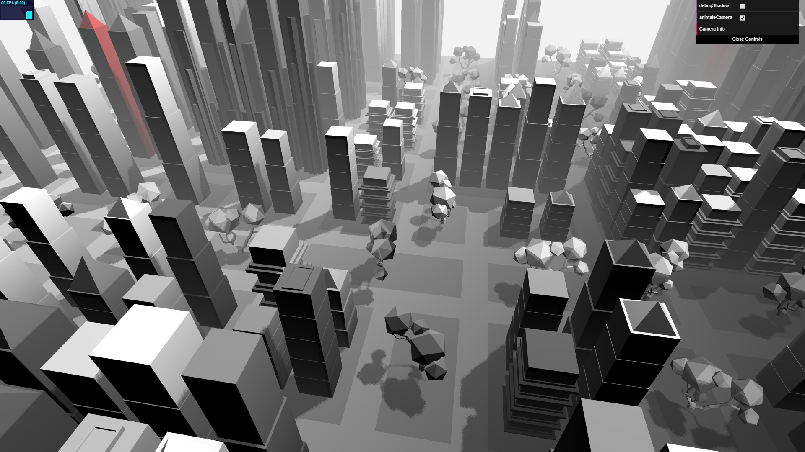
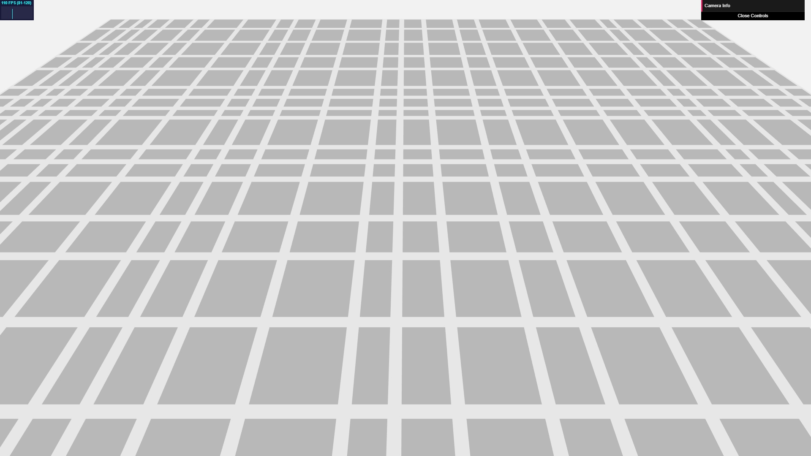
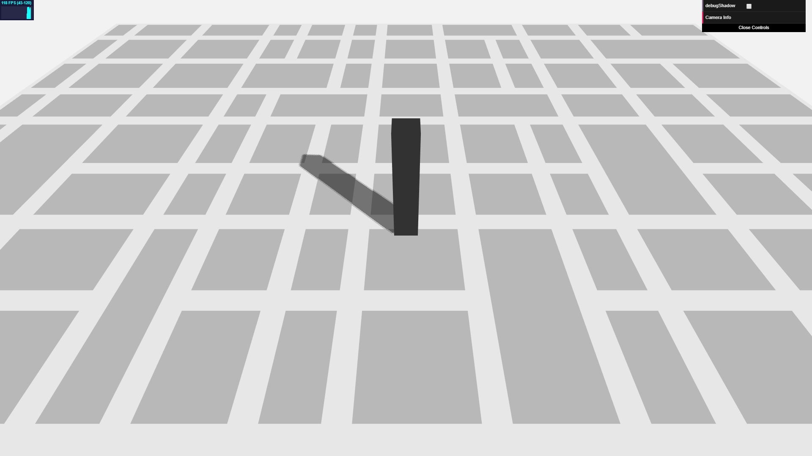
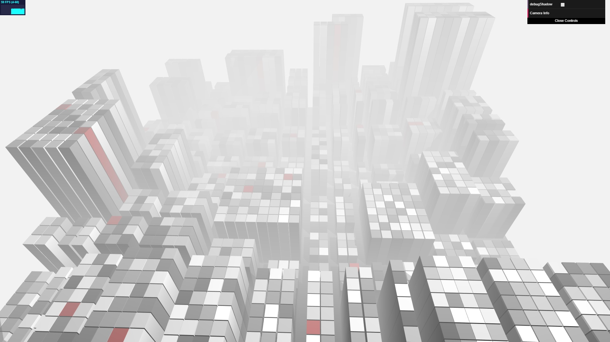
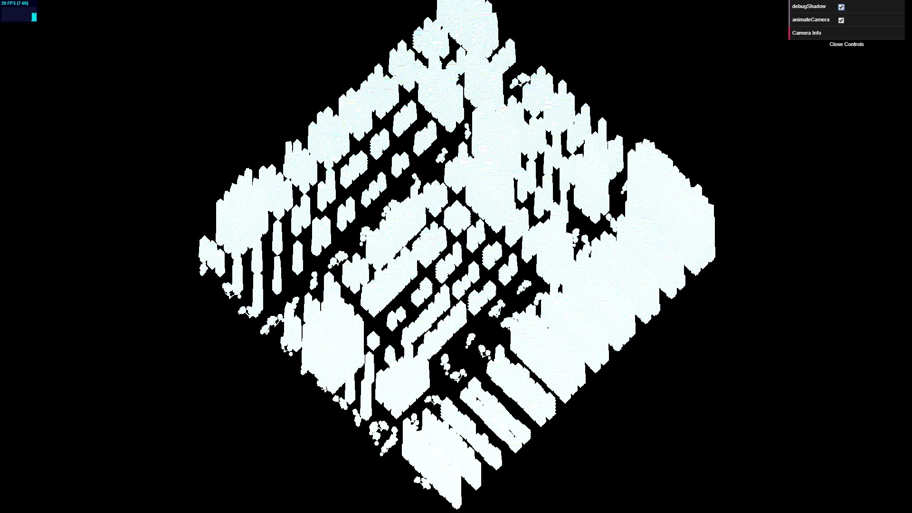

# Procedural City

This is my UPenn CIS566 Procedural Graphics course project. **Please refresh the demo page several times so that you can see different style cities** and everything(building and city layout) is procedural generated.

## [Demo Link](https://hanmingzhang.github.io/homework-5-shape-grammar-city-HanmingZhang/)

## ScreenShot

## Shape Grammar
- There are low, medium, high three types of buildins and each type has different shape grammar and generate differnet buildings. 
-  Low buildings are more likely to have a repeating pattern design(in Y direction), medium buildings usually have a pyramid top and super high buildings are likely to rotate(based on parent shape grammar node). 
- All buldings'(including their children nodes) or trees's size are random(although for some buildings, it's not so obvious).
- In terms of some building design, I refer a lot from [Procedural City, Part 3: Generating Buildings](https://shamusyoung.com/twentysidedtale/?p=2968) and [Kludge City](http://kludgeworks.com/kludgecity/).

## City Layout
- The basic layout is uniform. Here are two extra things I did to make it more realistic:
    - randomly move the dividing line so that each block has a different size. Here is what I get:
    
    - randomly selet several blocks to merge. And there are three strategies I use: merge in X direction, in Z direction or both in X and Z direction. Here is the final blocks I get:
    

- Population density: 2D Perlin noise is used to generate every block's population so that I can create higher building for high density blocks and it's not purely random between near blocks. The result looks good and here is final density I get(the hight of buildings represents density):

- Small blocks as parks: after random division and merging some blocks, there will definitly some blocks are too small to generate buildings. Although there is only one tree, I regard them as parks in my city!

## Other features
- **Shadow Map**: here is the shadow map I pre-baked before WebGL really render our scene:

in terms of some implementation details, I refer a lot to [WebGL Tutorial: Directional Shadow Mapping without extensions](http://www.chinedufn.com/webgl-shadow-mapping-tutorial/)
- vertex color to simulate **AO**: this idea is from [How to Do a Procedural City in 100 Lines](http://learningthreejs.com/blog/2013/08/02/how-to-do-a-procedural-city-in-100lines/). Basically, instead of using a uniform color for each building, it ues vertex color which is a property of each vertex, and if a vertex is low in Y direction, its color is darker so that, finally, our building looks brighter when it gets higher and this is the same as what we see in our real life because the high portion of one building will definitly receive more sun light.
- **Fog**: [CREATE A FOG SHADER](http://in2gpu.com/2014/07/22/create-fog-shader/) helps me a lot when I try to implement some fog effects in my city and it blends quite well as a result.
- Key frame camera motion: It's just a try to better present my city and I disable the original contolable camera, it can be paused using UI.